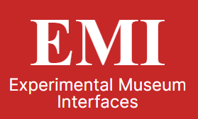

<!-- PROJECT LOGO -->
 

  

<h3 align="center">Experimental Museum Interfaces</h3>

  

    EMI is a holding page for the research conducted by Dave Walsh and others looking at the research areas of Generous interfaces and rich prospect browsers to make exploring Museum Collections Online easier and more enjoyable.
     
    <a href="https://github.com/walshd/ExperimentalMuseumInterfaces"><strong>Explore the docs »</strong></a>
     
     
    <a href="https://github.com/walshd/ExperimentalMuseumInterfaces">View Demo</a>
  

<!-- TABLE OF CONTENTS -->

  
Table of Contents

  <ol>
    <li>
      <a href="#about-the-project">About The Project</a>
      <ul>
        <li><a href="#built-with">Built With</a></li>
      </ul>
    </li>
   
  </ol>

<!-- ABOUT THE PROJECT -->

## About The Project

Here's a blank template to get started: To avoid retyping too much info. Do a search and replace with your text editor for the following: `github_username`, `repo_name`, `twitter_handle`, `linkedin_username`, `email_client`, `email`, `Experimental Museum Interfaces`, `project_description`

(<a href="#readme-top">back to top</a>)

### Built With

- 
- 

(<a href="#readme-top">back to top</a>)

<!-- CONTACT -->

## Contact

Your Name - [@twitter_handle](https://twitter.com/walsh_d) - walshd@edgehill.ac.uk

Project Link: [https://github.com/walshd/ExperimentalMuseumInterfaces](https://github.com/walshd/ExperimentalMuseumInterfaces)

(<a href="#readme-top">back to top</a>)

